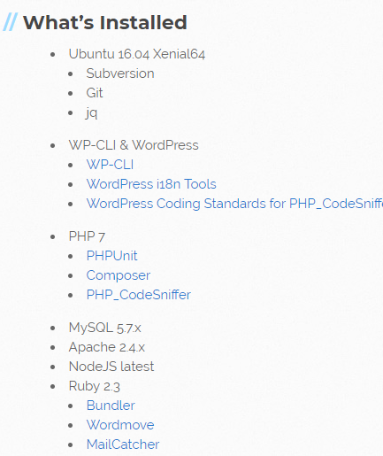
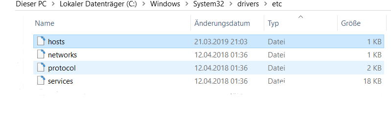
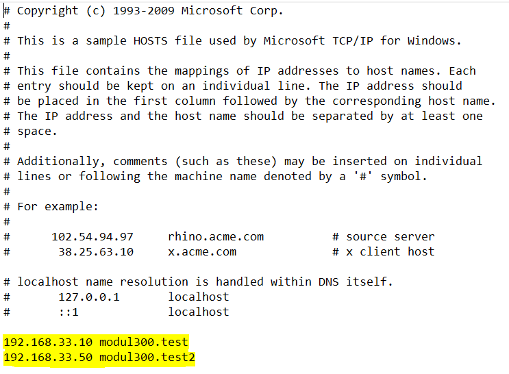
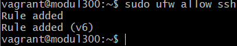
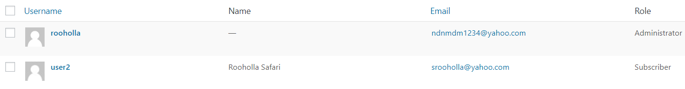
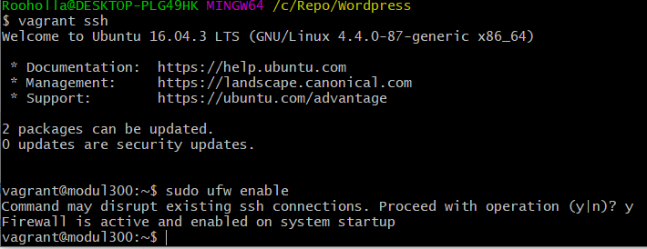

# M300 - Plattformübergreifende Dienste in ein Netzwerk integrieren
Rooholla Safari

Version 1.5, 17.04.2019

#### Voraussetzungen für Servicenutzung

* 1 GB freiem RAM und ca. 20 GB freiem Harddisk.
* Schnelles Internet

### Inhaltsverzeichnis

* [Versionierung](#Versionierung)
* [Einleitung](#Einleitung)
* [Auftrag und Planung](#AuftragundPlanung)
* [Vorbereitung](#Vorbereitung)
* [Wordpress Service](#WordpressService)
* [Sicherheitsaspekte](#Sicherheitsaspekte)
* [Testfälle](#Testfälle)
* [Netzwerkplan](#Netzwerkplan)
* [Reflexion](#Reflexion)

## Versionierung

Datum           Editor         Version          Änderung
09.03.2019      Rooholla       1.0            - Mindmap, Ideen

16.03.2019      Rooholla       1.1            - Projektplanung, Vorgehen

16.03.2019      Rooholla       1.2            - Erstellung eines Zeitplans, Projekt Umsetzung

22.03.2019      Rooholla       1.3            - Informationsbeschaffung zur Anpassung

23.03.2019      Rooholla       1.4            - Fragen die abgeklärt werden müssen

## Einleitung

Dies ist eine Dokumentation für das Vagrant File für einen Wordpress Service. Sobald man vagrant startet kann man den Service so erreichen: Beim Browser einfach modul300.test eingeben. Als admin kann man sich da anmelden indem man am schluss noch ein /wp-admin hinzufügt. Dort kann man schliesslich Änderungen vornehmen und die Webseite anpassen.
Modul 300 Lernziele:
Link: https://cf.ict-berufsbildung.ch/modules.php?name=Mbk&a=20101&cmodnr=300&noheader=1

Befehle bei Git
$  git status                      # Geänderte Datei(en) werden rot aufgelistet
$  git add -A                      # Fügt alle Dateien zum "Upload" hinzu
$  git status                      # Der Status ist nun grün > Dateien sind Upload-bereit 
$  git status                      # Dateien werden nun als "zum Pushen bereit" angezeigt
$  git push                        #Upload bzw. Push wird durchgeführt

Befehle bei Vagrant
$ vagrant up                       #Vagrant starten
$ vagrant destroy -f               #VM löschen
$ vagrant ssh                      #SSH-Verbindung zur VM aufbauen
$ vagrant init ubuntu/xenial64     #Vagrantfile erzeugen

## Auftrag und Planung

Unser Auftrag ist es Dienste im Netzwerk zur Verfügung zu stellen und diese per 'Infrastructure as Code' zu realisieren. Mit einem Vagrant File soll dies realisiert werden. Somit kann man diese Dienste mit einem vagrant up starten und anzeigen lassen.

Mein Teamkollege Flavio Paganini hat CheckMKund als Service realisiert und ich habe mich dazu entschieden einen Wordpress Service zur Verfügung zu stellen.
Die Ideen von uns beiden waren:

Unsere ersten Ideen:
* Apache Web Server mit Zusatzfunktionen
* Ein Backup Service
* VLC Stream Server
* Teamspeak Server
* CheckMK
* Wordpress Service
* Ghost
* SQL Database Server

Ich habe dann meinen Teil erledigt und Herr Paganini seinen Teil.

## Vorbereitung
Folgende Vorbereitung mussten getroffen werden um die Umgebung für die 'Service as Code' zu ermöglichen.
* Github
* Git-Bash
* Virtual Box
* Vagrant
* Visual Studio Code

### Github
Als erstes mussten wir einen Account bei Github erstellen und die eingegebene Mail verifizieren. Danach einloggen und ein Neues Projekt auf der Hauptseite erstellen. Diese Projekte nennen sich Repository und gelten als Ablage für ausgeführte Arbeiten. Dieses setzten wir auf Public um anderen Zugriff auf unser Projekt zu verschaffen. Mit der README Datei kann man das Projekt dokumentieren und versionieren.

Githublink zu meinem Projekt: [https://github.com/Rooholla1234/M300.git]

Als nächstes muss man einen private SSH Key generieren und dem Github Account zuweisen. Dazu braucht man eine Bash Terminal, welches auf einem Windows Computer noch zusätzlich installiert werden muss.

### Git-Bash / Git-Client
Folgender Befehl muss in dem Bash Terminal eingegeben werde : ssh-keygen -t rsa -b 4096 -C "eigene@mail.adresse".

Es muss die Mail Adresse des Github Accounts verwendet werden um diese zu verknüpfen. Man sollte dieser SSH Key mit einem Passwort hinterlegen damit man dies nur einmalig eingeben muss. Folgende Datei wird erstellt "%HOME%/.ssh/id_rsa.pub" diese sollte man in die Zwischenablage kopieren. Diese Datei muss man unter den GitHub Account Settings einfügen unter NEW SSH Key kopieren.

Zusätztlich muss ein Git-Client installiert werden um Lokal mit den Daten von dem GitHub Repository zu arbeiten. Damit ermöglicht man das arbeiten von mehreren Personen an dem Projekt.
Mit dem Befehl git pull kann man die Daten vom Repository herunterladen. Danach kann man in das Verzeichnis wechseln in dem das Projekt überarbeitet wurde und diese mit git add -A dem Upload hinzufügen. Diese Upload müssen mit git commit -m "Kommentar" bestätigt werden und mit dem Befehl git push werden die Daten ins Repository übernomen.

### VirtualBox
VirtualBox wird als Tool benutzt um die Virtuellen Maschinen zu erstellen nach den Vorgaben des Vagrantfiles.

Virtual Box: https://www.virtualbox.org/

### Vagrant

Vagrant wird unser Programm sein welches den Code in eine Virtuelle Maschine umwandelt. Vagrant benutzt keine ISO's sondern sogennante Boxes welche im Internet zur Verfügung stehen.

Sofern man ein Vagrantfile hat kann man in dessen Verzeichnis wechseln im Bash Terminal und eine VM Starten mit dem Befehl vagrant up. Löschen kann man diese Virtuelle Maschine mit dem Befehl vagrant destroy.

### Visual Studio Code

Als Texteditor wir Visual Studio Code verwendet, dies aus dem Grund da Visual Studio Code sehr kompatible für verschiedene Programmiersprachen sowie Syntax von Dateitypen. Auch kann man mit diesem Programm die Daten direkt ins Repository hochladen ohne ein Terminal zu benutzen.

## Wordpress Service

Um Wordpress zu installieren, kann man ganz einfach auf die Webseite vccw.cc. Diese wird von einer Gruppe von Jugendlichen verwaltet, welche verschiedene Softwarelösungen für Vagrant und weitere virtuelle Lösungen anbieten. In einem Zip File sind alle Dokumente enthalten, welche man für den Wordpress Service braucht. Da gibt es zum Beispiel: Ruby 2.3, es wird automatisch eine SQL Datenbank erstellt, ebenfalls ein Apacheserver und vieles mehr.

Hat man das Zip File heruntergeladen, erstellt man im lokalen Repo einen neuen Ordner und extrahiert die Daten in diesem Ordner. Das yaml File muss jetzt konfiguriert werden damit das ganze nun funktioniert. Hier sieht man die Einstellungen, bei denen man ein bisschen Freiraum hat:

Eine IP-Adresse ist zusehen und den Server selbst muss man manuell eingeben. Bei meinem Projekt habe ich modul300.test benutzt. Diese IP-Adresse muss jetzt noch im Hosts eingefügt werden, damit auf diese Webseite zugegriffen werden kann. 

Diese kann nur geöffnet und bearbeitet werden wenn man zuerst Notepad als Administrator öffnet und den Host dann im Nachhinein öffnet. Dann die IP-Adresse und die Webseite eintragen und abspeichern.

Dann vagrant up eingeben und entweder die IP-Adresse im Browser öffnen oder modul300.test.

## Sicherheitsaspekte

Mein Service ist anhand eines Logins geschützt. Diese wurde erstens im Host bearbeitet und hinzugefügt und auch ein Benutzer wurde dem Service zugewiesen. Da meine Webseite auf Ubuntu basiert habe ich ebenfalls einen Firewall angeschaltet und eine Rule hinzugefügt. Diese ist unten zu sehen.

Ich wollte noch zusätzlich einen Mailcatcher auf Port 1080 installieren. Bei der Installation ist alles super verlaufen und alles hat funktioniert. Ich weiß nicht genau, ob die IP auch im Host eingetragen muss, da sie die gleiche ist, jedoch ein andere Port benutzt. Diese ist schon freigegeben, jedoch funktioniert das trotzdem nicht. Ich habe versucht den Port manuell zu öffnen und auf die Webseite zuzugreifen. Das hat leider nicht funktioniert und war nicht das Problem. Ich habe im Internet nach einer Lösung gesucht und leider auch nichts gefunden bei dem jemand ein Webpress Service auf Vagrant aufgesetzt hat mit Mailcatcher Funktion. SSH wurde bei der Firewall freigegeben.

Bei der Admin Umgebung kann man auch einen User hinzufügen. Dies habe ich gemacht mit beschränkte Berechtigungen.

## Testfälle

### Firewall 
Firewall funktioniert einwandfrei. Port wurde freigegeben und hier ist das Resultat.

### Webseite
Die Webseite funktioniert auch einwandfrei. 

### MailCatcher

Diese Funktion hat leider nicht funktioniert. Der Port 1080 wurde für den MailCatcher freigegeben, doch ein Problem liegt bei der Versionierung der Software.

Quelle: <https://github.com/Varying-Vagrant-Vagrants/VVV/issues/1467>

Hat leider nicht funktioniert. Der Port wurde freigegeben und aus der Firewall exkludiert. 

## Netzwerkplan

    +---------------------------------------------------------------+
    ! Notebook - Schulnetz 10.x.x.x und Privates Netz 192.168.30.10 !                 
    ! Port: 8080 (192.158.30.10:80)                                 !  
    !                                                               !  
    !    +--------------------+          +---------------------+    !
    !    ! Wordpress Service  !          ! MySQL               !    ! 
    !    ! Host: Wordpress    !          ! Host: client        !    !
    !    ! IP: 192.168.30.1 0 ! <------> ! IP: 192.168.33.1    !    !
    !    ! Port: 80           !          ! Port: -             !    !
    !    ! Nat: 8080          !          ! Nat: -              !    !
    !    +--------------------+          +---------------------+    !
    !                                                               !  
    +---------------------------------------------------------------+

## Reflexion

Ich habe bei diesem Projekt sehr viel lernen können und habe vieles mitgenommen. Ich habe gelernt meine Troubleshooting Skills zu verbessern und mich mit Fehlern intensiver zu befassen. Mir hat das Projekt sehr viel Freude bereitet doch es war sehr zeitaufwendig. 

-------
